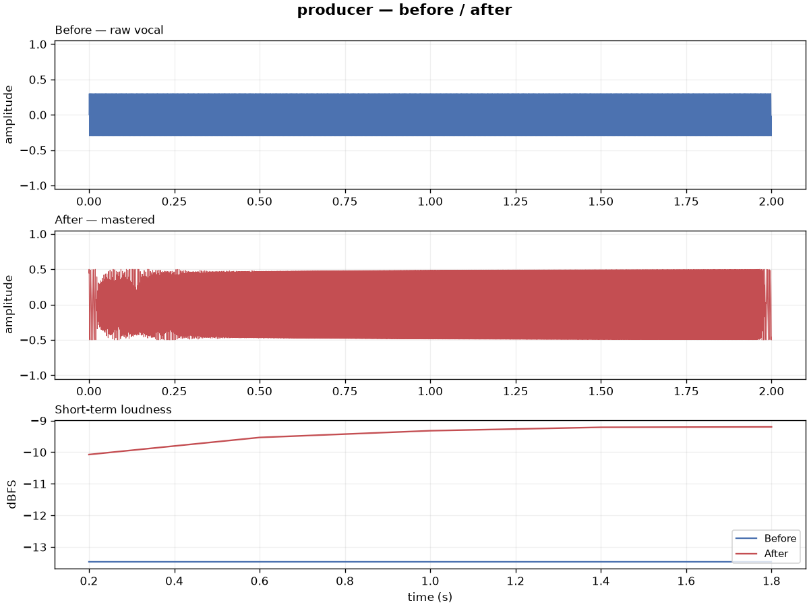

# producer

A CLI-only pipeline that analyzes, mixes, masters and QA-gates a raw vocal. It
exists to answer one question before anything else gets built on top of it: **is
automated processing good enough to sound release-ready?**



*Generated from the committed test fixtures with `producer master --premix --plot`.*

## Install

Requires Python 3.11.

```bash
git clone https://github.com/LaxRaj/MixMax.git
cd MixMax
uv venv --python 3.11
source .venv/bin/activate
uv pip install -e ".[dev]"
```

Using pip instead of uv:

```bash
python3.11 -m venv .venv && source .venv/bin/activate
pip install -e ".[dev]"
```

## Quickstart

From a fresh clone, this runs end-to-end on the committed fixtures:

```bash
producer master \
  --vocal tests/fixtures/target.wav \
  --reference tests/fixtures/reference.wav \
  --out out.wav \
  --plot
```

You get `out.wav`, a QA verdict printed to the terminal, and
`out.comparison.png`.

## Commands

### `producer analyze --vocal PATH [--out PATH]`

Tempo, voiced pitch range and dynamic range, as JSON. Every value is guaranteed
finite, so downstream reports can rely on it.

```json
{ "tempo_bpm": 120.19, "pitch_min_hz": 0.0, "pitch_max_hz": 0.0, "dynamic_range_db": 43.94 }
```

### `producer mix --vocal PATH --out PATH`

Runs the vocal through the mix chain, in signal order:

| Stage | Purpose |
| --- | --- |
| `HighpassFilter` 80 Hz | rumble, mic handling, HVAC |
| `NoiseGate` −40 dB | room noise between phrases |
| `Compressor` −18 dB, 3:1 | even out performance dynamics |
| `PeakFilter` 7 kHz, −4 dB | de-ess the sibilance band |
| `Reverb` room 0.15, wet 0.08 | subtle space |

These are conservative starting values meant to be tuned against real listening
feedback, not learned parameters.

### `producer master --vocal PATH --reference PATH --out PATH [--premix] [--plot]`

Matches the vocal to the tonal and loudness profile of a reference track via
[`matchering`](https://github.com/sergree/matchering), then runs the QA gate on
the result automatically.

- `--premix` runs the mix chain first and masters *that* instead of the raw vocal.
- `--plot` also writes a before/after comparison PNG next to the output.

### `producer qa --file PATH`

The automated gate. Reports integrated LUFS, full-scale clipping and mono
fold-down compatibility, and names each failed check in plain words.

```json
{
  "lufs": -11.9,
  "clipping_detected": false,
  "mono_compatible": true,
  "pass": true,
  "flags": []
}
```

A file passes when it does not clip, sits between −16 and −9 LUFS, and survives
a mono fold-down. Thresholds live at the top of `producer/qa.py`.

### `producer batch --input-dir DIR --reference PATH --out-dir DIR`

The friend-test harness. Runs analyze → mix → master → QA over every `.wav` and
`.mp3` in a folder, writes `<name>_mastered.wav` per file, and generates
`report.md`: a pass-rate summary, a per-file metrics table, the specific flags,
and an empty table for your own subjective "does this sound release-ready"
verdict per file.

```bash
producer batch \
  --input-dir ~/vocals/friends \
  --reference tests/fixtures/reference.wav \
  --out-dir ./out
```

A failure on one file is recorded as a flag rather than sinking the whole batch.

## Tests

```bash
pytest -q
```

The suite runs entirely on synthetic fixtures generated at test-setup time — no
real audio required. The fixtures are also committed so the quickstart above
works from a clean clone.

## Scope

This is an internal tool, not a public release. No web UI, no instrumental
generation, no distribution — see `PLAN.md` for the full non-goals list and the
milestone history.

Known gap: no pitch correction in the vocal chain yet. That's deliberate — the
base chain gets validated against real listening feedback first.

## License

MIT — see [LICENSE](LICENSE).
